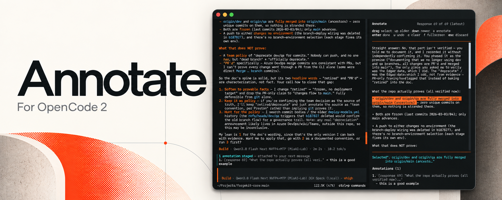
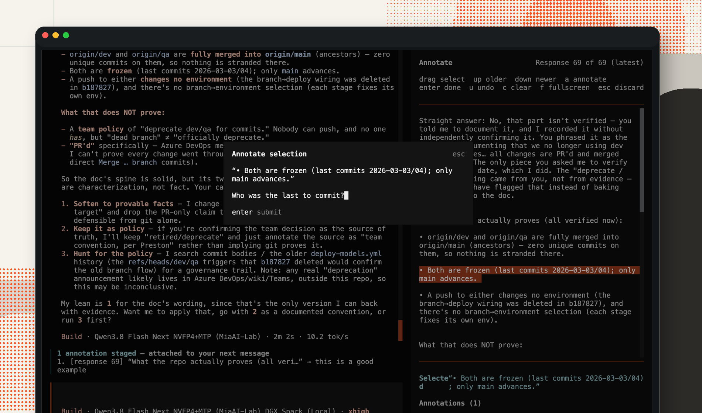

# opencode2-annotate-plugin

OpenCode V2 TUI plugin: select spans of assistant responses, attach a
question or comment to each, and send them all as your next prompt. Modeled on
the Codex desktop "Add to chat" response-annotation flow, with per-span
comments (which Codex does not yet support).

## Installation

Requires OpenCode **V2** with CLI plugin support, the `session.panel` slot,
and the `session.hook("prompt")` API. Developed with
`opencode2 v0.0.0-beta-19425`; GitHub package installation is tested with
`v0.0.0-beta-19507`. Compatibility with other beta builds may vary.

Install directly from GitHub using OpenCode's plugin manager:

```sh
opencode2 plugin add github:prestonlogan/opencode2-annotate-plugin
```

If your executable is named `opencode`, use that instead of `opencode2`.
The installer downloads the package and adds it to your global configuration.
Restart OpenCode, then run `/annotate` in a session. No manual clone or build
is needed; the package includes the compiled TUI entrypoint.

To install the tagged release instead of the default branch:

```sh
opencode2 plugin add github:prestonlogan/opencode2-annotate-plugin#v0.1.0
```

For default-branch installations, check for and install updates with:

```sh
opencode2 plugin check
opencode2 plugin update github:prestonlogan/opencode2-annotate-plugin
```

Restart the TUI after updating. Install only one copy: if migrating from a
manual clone, move the old directory outside OpenCode's plugin discovery paths
and remove its local entry from `opencode.json` before using `plugin add`.

### Local development

To work on the plugin source instead:

```sh
git clone https://github.com/prestonlogan/opencode2-annotate-plugin.git \
  ~/.config/opencode/plugins/annotate
```

Add `"./plugins/annotate"` to the `plugins` array in
`~/.config/opencode/opencode.json`, preserving your existing entries:

```json
{
  "plugins": ["./plugins/annotate"]
}
```

Install build dependencies and compile the TUI from the cloned directory:

```sh
npm ci
npm run build
```

Restart OpenCode after rebuilding to load TUI changes. The compiled
`dist/tui.js` is checked into Git so GitHub installations need no build hooks.

The attach-on-send hook currently requires the TUI and server to share the
same local state directory. Remote servers with separate filesystems are not
supported by this storage bridge. Annotation drafts are stored in OpenCode's
state directory, outside this repository.

## Usage

1. In a session with at least one assistant reply, run `/annotate` (also in
   the `Ctrl+P` palette under **Annotate**). A side panel opens showing the
   latest assistant response as plain text. Use **Up** for an older response
   and **Down** for a newer one; the header shows **Response N of M**.
2. **Drag** across words to select a span (whole-word granularity, any length,
   across lines).
3. Press **`a`** and type your question or comment about that span.
4. Repeat for as many spans and responses as you like. Browsing keeps every
   annotation staged; each is labeled with its source response.
5. Press **`Enter`** when you're done. The panel closes and the annotations
   stay staged: a summary strip appears above the composer showing what will be
   attached to your next message. Run `/annotate` again to edit them, or `Esc`
   in the panel to discard.
6. Type your message in the composer and send it as usual. The staged
   annotations are **attached automatically** to that prompt, the strip
   disappears, and the panel (if reopened) closes.



*Select a span and press `a` to add a question or comment; saved annotations stay staged above the composer.*

Press **`Esc`** in the panel to discard instead. If anything is staged you get a
confirmation first; with nothing staged it simply closes.

In the composer, **`Ctrl+C`** clears staged annotations immediately, together
with any typed draft, without confirmation. With annotations alone, it clears
them without triggering exit. With nothing staged, OpenCode handles the key
normally; the panel's `Esc` confirmation behavior is unchanged.

### Panel keys

| Key     | Action                                   |
| ------- | ---------------------------------------- |
| drag    | select words                             |
| `Up`    | show the previous (older) response        |
| `Down`  | show the next (newer) response            |
| `a`     | annotate the current selection           |
| `Enter` | done: keep staged and close the panel    |
| `u`     | remove the last annotation               |
| `c`     | clear the current selection              |
| `f`     | toggle fullscreen                        |
| `Esc`   | discard staged annotations (confirms) and close |

## What the model receives

```
I have annotated specific parts of your earlier responses. Each annotation
quotes the exact span I selected, followed by my question or comment about
that span. Source labels identify the response being discussed. Please address each one.

[1] "quoted span one"
    Source: assistant response 2 (message msg_example_2)
    → your comment

[2] "quoted span two"
    Source: assistant response 5 (message msg_example_5)
    → your comment
```

Inline Markdown (`**bold**`, `` `code` ``, links, list markers) is stripped
from the displayed text and quoted spans so the prompt stays clean.

## Behavior notes

- **Navigation**: opens on the latest text-bearing assistant message. Up/Down
  browse the session's text-bearing assistant messages in chronological
  order, stopping at either end. Tool-only messages are skipped. Changing
  response clears the temporary selection and resets scrolling to the top.
  Reopening starts at the latest response; staged annotations from all visited
  responses remain visible. `u` removes the most recently added annotation
  across all responses.
- **History loading**: opening the panel fetches every page of session history
  independently of the transcript's lazy-loaded cache. Browsing and adding
  annotations become available once loading completes, so response numbering
  uses the full history. Live cached messages update the fetched history for
  display. If loading fails, reopen `/annotate` to retry.
- **Persistence**: staged annotations are stored per session via the plugin
  storage API. Each annotation records its source message ID; the draft's
  outer message ID tracks the latest assistant message when staged, independently
  of which older response is being annotated. They survive closing the
  panel and restarting; they are dropped automatically once a newer assistant
  reply exists.
- **Attach-on-send**: the server half registers a `session.hook("prompt")`
  that prepends any staged annotations to the next user prompt for that
  session and then deletes the session's store entry. Drafts predating a new
  assistant reply are skipped; selecting an older response does not make a
  draft stale. Both halves read the same
  store file:
  `~/.local/state/opencode/<channel>/tui/plugin.local.annotate.tui.annotations.json`.
  The TUI watches that entry: when it vanishes, the composer strip hides and
  an open panel auto-closes. Sending is always done from the composer, so it
  follows the composer's own delivery semantics.
- **Selection**: the panel deliberately does not use OpenTUI's native text
  selection (which the host wires to copy-to-clipboard). Each word is its own
  renderable and the drag range is hit-tested from mouse coordinates.

## Files

- `index.ts` — server half (`local.annotate`); the attach-on-send prompt hook.
- `tui.tsx` — panel, composer strip, `/annotate` command.
- `build.mjs` — compiles TSX with Solid's universal OpenTUI transform.
- `dist/tui.js` — precompiled TUI entrypoint used by installed packages.
- `shared.ts` — types, prompt builder, and store-path helpers used by both.
- Registered in `~/.config/opencode/opencode.json` under `plugins` as
  `"./plugins/annotate"`.
